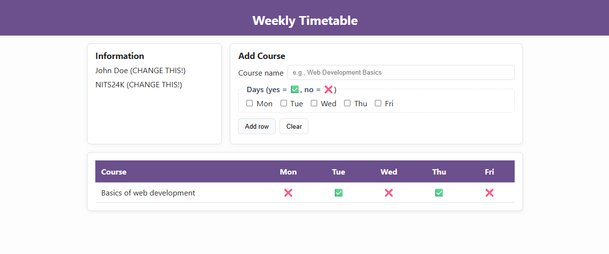

# Task F — Functionality First: “Add row” table behavior

> [!NOTE]
> The material was created with the help of ChatGPT and Copilot.

* **Starter page:** [https://vheikkiniemi.github.io/BasicsOfWeb2025SPages/task-f/](https://vheikkiniemi.github.io/BasicsOfWeb2025SPages/task-f/)  
* **Target behavior (and general look):** 

## 🎯 Objectives

* Recreate the **table behavior** so that clicking **Add row** appends a **new row** to the table and it behaves like in the target.
* Only **change colors** by applying the required palette (no other visual redesign needed).
* Publish via **GitHub Pages** and submit the **public URL**.

## 🧰 Required Tools

* VS Code, Git + GitHub (Pages enabled)
* Browser DevTools (Elements & Console)

## 🎨 Required color palette (only visual change)

Add to your CSS `:root` and use these variables (replace hard-coded colors for page bg, text, brand, alt row, borders):

```css
:root {
  --page-bg: #fcfdfc;
  --text: #2a2a2a;
  --brand: #6c4f8d;
  --table-alt: #f9f5ff;
  --border: #e0e0e0;
}
```

## 🧪 Instructions

> Keep your page neat and readable—consistent spacing, alignment, and colors go a long way. (Same “professional look” spirit as Task E.) 

1. **Copy the starter** page into your repo under `task-f/` (`index.html`, `style.css`, `index.js`).
   * Open the **starter page** in your browser.
   * View Page Source and copy the HTML into `task-f/index.html`.
   * Save the referenced CSS (via the `<link>` or DevTools) as `task-f/style.css`. 
   * Save the referenced Javascript (via the `<script>` or DevTools) as `task-f/index.js`. 
2. **Hook up the “Add row” button** so that:

   * A new `<tr>` = `row` is appended to the table.
   * Cells are populated with sensible default values.
3. **Apply the color palette** via the five variables above. Do **not** do any other styling changes.
5. **Publish** with GitHub Pages and verify the live URL works (HTTP 200).

---

## ✅ What we will check (acceptance)

* **Add row behavior** works: clicking the button appends a **new row at the end** of the table body.
* **Row content**: the new row contains **valid, visible values**.
* **Palette enforced** using the five variables (no stray hard-coded colors for page bg, text, brand, alt rows, borders).
* **Published** on GitHub Pages; the submitted URL opens your Task F page.
* Link **Submitted** on time to **itslearning**

---

## 🔍 Self-check before submitting

* [ ] Page looks **like the target** (structure, spacing, typography scale).
* [ ] Interactions and states behave like the reference.
* [ ] The **five CSS variables** exist and are used for background, text, brand accents, alt rows, and borders.
* [ ] Semantic HTML and accessibility basics in place.
* [ ] GitHub Pages URL works and shows **Task F**.

---

## 🌱 Professional look & feel (applies to all tasks)

Keep spacing, alignment, and color usage consistent. Avoid low contrast, inconsistent fonts/sizes, and clutter. The instructor may reject a page that looks non-professional even if it technically meets minimum checks (same policy as Task E). 

